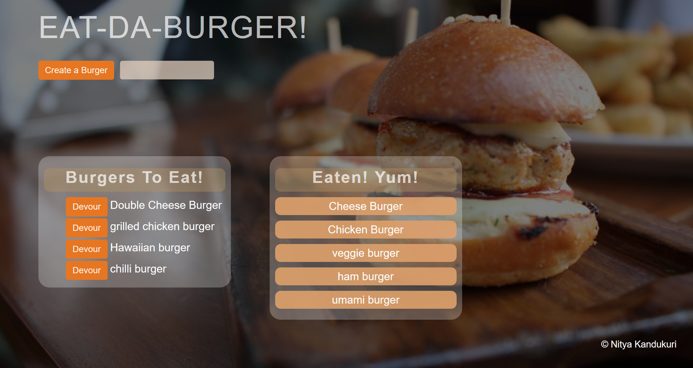

<h1> Burger</h1>

A Full Stack Application with MySQL, Node, Express, ORM, Handlebars, and Bootstrap

<h4>Functionality</h4>

Eat-Da-Burger! is a restaurant app that lets users input the names of burgers they'd like to eat.

Whenever a user submits a burger's name, the app will display the burger on the left side of the page -- waiting to be devoured.

Each burger in the waiting area also has a Devour! button. When the user clicks it, the burger will move to the right side of the page.

Your app will store every burger in a database, whether devoured or not.

Link to Deployed Site::  <a href="https://burger-app-nk.herokuapp.com/">Burger</a>

<h4>NPM Packages Required</h4>

Express, Body-Parser, MySQL,handlebars,nodemon

<h4>Installation</h4>

To run the application locally, first clone this repository with the following command.

<ul>
<li>git clone https://github.com/nkand84/burger.git</li>
<li>cd burger</li>
</ul>

Next, install the application dependencies.

<ul>
<li>npm install</li>
</ul>

Finally, run the node server

<ul><li> nodemon server.js</li></ul>

Now, open the local application on port 3000 at the URL: http://localhost:8080/

Enjoy a burger!
